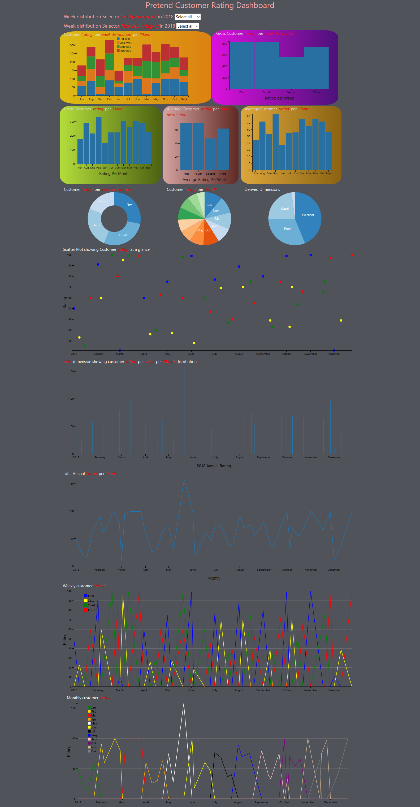

# [Pretend Dashboard]( https://achileachile.github.io/Pretend-Dashboard/)

## Purpose:
<i>"Pretend Dashboard"</i> is a project work developed in partial fulfilment for the requirements of
the Interactive Frontend Development by the Code Institute, Ireland.

## Brief:
####    CREATE A DATA DASHBOARD
Build a data dashboard that visualizes a dataset of your choice
Your data can be stored locally (e.g., in a js file) or sourced from an API
Visualise your data using D3.js and dc.js

## Technologies Used and Dependencies
The tehnologies used for the design of this app are:
1. html5: 
    +   It provides the markup language used develop core content and structure of this application.
        +   https://www.w3.org/html/

2. css3:
    +   https://www.w3.org/Style/CSS/
        +   Cascading style sheet 3 is used to style and describe the presentation of the html5 markup in this project
    
3. javaScript:
    +   It is the logic used to manipulate review.json to develop the dashboard.
    +   It is the parent language on which the frameworks used to develop this projects are written e.g d3.js, dc.js, queue.js, crossfilter.js.
    +   It provides the window.Onresize() that is used to offsetWidth of the bars to fit into the size of a new widow.
    +   It is used in conjunction with html to render the chart in the browser
    
4. bootstrap
    +   https://getbootstrap.com/
    +   href="https://maxcdn.bootstrapcdn.com/bootstrap/3.3.7/css/bootstrap.min.css
        +   it is used to apply the rule of third to the styling of row and column with a view to enhance responsive design
   
5.  Data Driven Documents, d3.js
    +  https://d3js.org/
    +  https://cdnjs.cloudflare.com/ajax/libs/d3/3.5.17/d3.min.js
        +   It makes use of SVG, HTML5, and CSS standard draw charts and graph from the provided review.json data set data set
        +   It provides the background and platform to run dc.js
6.  Dimensional Charting, dc.js
    +   http://bl.ocks.org/jun9/raw/5631952/
    +   https://cdnjs.cloudflare.com/ajax/libs/dc/2.1.8/dc.js
        +   It leverages d3 to render ther rating charts and graphs in CSS-friendly SVG format from the provided review.json data set
7.  Crossfilter.js
    +   http://square.github.io/crossfilter/
    +   https://cdnjs.cloudflare.com/ajax/libs/crossfilter/1.3.12/crossfilter.min.js
        +   Crossfilter is used visualise the dependencies of the data in the charts. It makes them interactive.
8.  Queue.js
    +   http://bl.ocks.org/mapsam/6090056
    +   https://cdnjs.cloudflare.com/ajax/libs/queue-async/1.0.7/queue.min.js
        +   It uses the defer() to load multiple data from review.json in d3.json format before running the rest of the code
9.  JSON
    +   https://www.json.org/
        +   It provides the format for to store, retrieve and parse data in review.json
10.  Cloud9
    +    https://c9.io/ufedo
        +   It provides the IDE for the development of this project

## Additional Technologies Required to Use app:
+   None

## UXD

## Wireframes

## Testing
####    Firefox Simulation
    
    

## Deployment
## Credits
## Acknowledgements
   

Project Purpose 5,
UX design 4, 
Suitability for purpose 3, 
Navigation 3,
Ease of Use 4, 
Information Architecture 4, 
Responsive Design 3, 
Image Presentation 3,
Colour scheme and typography 2, 
Appropriate use of HTML 3, 
Appropriate use of CSS 4, 
Directory Structure and File Naming 4, 
Version Control 2, 
Testing implementation 2, 
Testing write-up 2, Readme file 3, 
Comments 3, 
Deployment implementation 5, 
Deployment write-up 0