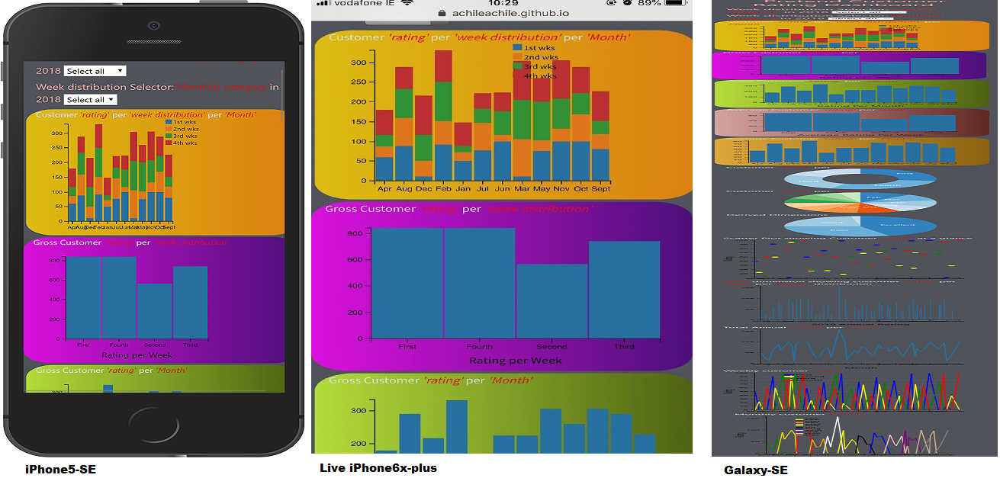

# [PRETEND DASHBOARD]( https://achileachile.github.io/Pretend-Dashboard/)

## PURPOSE:
<i>"Pretend Dashboard"</i> is a project work developed in partial fulfilment for the requirements of
the Interactive Frontend Development by the Code Institute, Ireland.

## BRIEF:
####    CREATE A DATA DASHBOARD:
Build a data dashboard that visualizes a dataset of your choice
Your data can be stored locally (e.g., in a js file) or sourced from an API
Visualise your data using D3.js and dc.js

## TECHNOLOGIES AND DEPENDENCIES
The tehnologies used for the design of this app are:
1. html5: 
    +   It provides the markup language used develop core content and structure of this application.
        +   https://www.w3.org/html/

2. css3:
    +   https://www.w3.org/Style/CSS/
        +   Cascading style sheet 3 is used to style and describe the presentation of the html5 markup in this project
    
3. javaScript:
    +   It is the logic used to manipulate review.json to develop the dashboard.
    +   It is the parent language on which the frameworks used to develop this projects are written e.g d3.js, dc.js, queue.js, crossfilter.js.
    +   It provides the window.Onresize() that is used to offsetWidth of the bars to fit into the size of a new widow.
    +   It is used in conjunction with html to render the chart in the browser
    
4. bootstrap
    +   https://getbootstrap.com/
    +   href="https://maxcdn.bootstrapcdn.com/bootstrap/3.3.7/css/bootstrap.min.css
        +   it is used to apply the rule of third to the styling of row and column with a view to enhance responsive design
   
5.  Data Driven Documents, d3.js
    +  https://d3js.org/
    +  https://cdnjs.cloudflare.com/ajax/libs/d3/3.5.17/d3.min.js
        +   It makes use of SVG, HTML5, and CSS standard draw charts and graph from the provided review.json data set data set
        +   It provides the background and platform to run dc.js
6.  Dimensional Charting, dc.js
    +   http://bl.ocks.org/jun9/raw/5631952/
    +   https://cdnjs.cloudflare.com/ajax/libs/dc/2.1.8/dc.js
        +   It leverages d3 to render ther rating charts and graphs in CSS-friendly SVG format from the provided review.json data set
7.  Crossfilter.js
    +   http://square.github.io/crossfilter/
    +   https://cdnjs.cloudflare.com/ajax/libs/crossfilter/1.3.12/crossfilter.min.js
        +   Crossfilter is used visualise the dependencies of the data in the charts. It makes them interactive.
8.  Queue.js
    +   http://bl.ocks.org/mapsam/6090056
    +   https://cdnjs.cloudflare.com/ajax/libs/queue-async/1.0.7/queue.min.js
        +   It uses the defer() to load multiple data from review.json in d3.json format before running the rest of the code
9.  JSON
    +   https://www.json.org/
        +   It provides the format for to store, retrieve and parse data in review.json
10.  Cloud9
    +   https://c9.io/ufedo
        +   It provides the IDE for the development of this project

## ADDITIONAL TECHNOLOGY REQUIRED TO USE APP:
None.
This app is tested on chrome 71.0.3578.98, microsoft edge, and fireforx 64.0., firefox developers edition, android,  iOS is 12.1.4, and the desired result was achieved. No additional technology is required

## REQUIREMENTS TO BUILD APP:
+   SUITABLE IDE e.g cloud9, notepad++

## FEATURES: 
Pretend Dashboard is developed from dataset stored in reveiw.json file, it contains information about how a given organization is rated in a customer feedback survey obtained in 2018.
The dataset is subdivided into the following dimensions-
+   date
+   Month
+   week
+   rating

Each of this dimensions is called by dc.js to plot the graph/chart or pie chart as the case maybe. The dataset is literarily defined by the 'week' dimension. The 'week' is subdivided into four categories
which are passed on under which they values of the rating are distributed, and these are:
+   'First' means first week of any Month
+   'Second' means second week of any Month
+   'Third' means third week of any Month
+   'Fourth' means fourth week of any Month

The value of 'First' at any point in date represents the rating in the first week of the Month under review. Consider January for instance, 'First', will indicate 
the the value of customer review in the first week of 'January'. 'Second' will also imply the value for the second week of January and ditto for 'Third' and 'Fourth'. Thus, a Month is given by rating in 'First', 'Second', 'Third' and 'Fourth' as the case
maybe.
The Year 2018 is summed up in twelve months from January to December hence a total of twelve multiply by four weeks.
At the top of the User Interface just below the heading there are two drop down boxes for 'week selector-week' and 'week selector-Month'. The 'week selector-week' provides a list of the following possible
selections and information at initial click on:
+   Select All
+   First: 12
+   Second: 12
+   Third: 12
+   Fourth: 12

This information implies that each 'week' category (i.e 'First', 'Second', 'Third' and 'Fourth') contains twelve dataset, one for each of the twelve distinct 'Months' in the 'Month'
dimension. This is just like Every Calender Month has four weeks in real life which follow each other in the chronological order of First Week, Second Week, Third Week and Fourth Week. Thus for the Twelve (12) Months of
the Year there are 12 First Weeks. This is ditto for Second, Third and Fourth.
In other words, each Month has one rating each in the 'First', 'Second', 'Third' and 'Fourth' category of the 'week' dimension, thereby adding up to a total
of twelve values for each of the 'week' categories in this twelve months period.
Similary, the 'week selector-Month', displays the value of rating for each of the Month in the Year under review. This value correspond to the agregates of the ratings
of the corresponding 'First', 'Second', 'Third' and 'Fourth' 'week' category of the week dimension. For example, review rating in January, the week-selector Month
Jan: 4, and the value of Jan: 4 denotes the numbers of data found for the Month of January which in this case is One for each of the 'week' category mention above. It also means that 
there is only one value corresponding to Jan in the data under review. This applies to the rest of the Month in through to December.
When a particular Month is selected on the Month distribution of the 'week selector', the value on the corresponding week-selector on the week distribution will display as follows:
+   First: 1
+   Second: 1
+   Third: 1
+   Fourth: 1

This implies that each selected Month has one dataset corresponding to each of the category of the 'week' under the week dimesion in the review.json. 
Pretend Dashboard is made of blocks of the following charts and graphs:
1.  A stacked chart for each of the 'week' distribution in the twelve months of 2018
2.  A bar chart showing the gross rating(s) for each of the 'week' category in 2018
3.  A bar chart showing the gross rating(s) for each Month of 2018
4.  The average of the gross customer rating for each 'week(s)' category
5.  The average of the gross customer rating fore each 'Month(s)' category
6.  A Doughnut showing customer rating for each 'week' category
7.  Customer rating per Month pie chart
8.  A Derived dimension pie chart
9.  Scatter plot
10. Vertical line graph showing customer rating for each date in the dataset
11. Line graph plucked on the date dimension for each date of the Year 2018
12. Composite line graph for 'week' dimension
13. Composite line graph for 'Month' dimension

##  USER EXPERIENCE
The charts, pie charts, and graphs listed above are ploted using dc.js just from one dataset (review.json) as a result they share a common dependency and are responsive
to one another. This is to say that if a value is clicked on any of the charts, the other dashboard will display a corresponding value to the date, week and Month which is defined by that dataset.
Users are provided with the following select options on the dashboard:
1.  week selector-week-
    +   Select all
    +   First: 12
    +   Second: 12
    +   Third: 12
    +   Fourth: 12
2.  week selector-Month-
    +   Select all
    +   Jan: 4
    +   Feb: 4
    +   March: 4
    +   April: 4
    +   May: 4
    +   Jun: 4
    +   Jul: 4
    +   Aug: 4
    +   Sept: 4
    +   Oct: 4
    +   Nov: 4
    +   Dec: 4

This selectors enable users to querry the dashboard and carry out the following operations:
1.  To view the total rating available on the dashboard, select 'Select all' on both the week and Month selectors
2.  To view a particular week category in a given month, select the desired month and the desired week. For example, to view the First week of January select Jan: 4 on the Month selector and First: 1.
    This value when selected, Jan: 4 will change to Jan: 1 and both selectors will then display Jan: 1, First: 1 on the month and week selectors respectively. This final information indicate that the users
    is viewing the one data in January from the one available rating from the First week of the month. 
3.  Users can view the ratings in the twelve weeks for each of the category in the 'week' dimension by selecting 'Select all' on the Month selector and the desired category on the week selector e.g First: 12
4.  Users may also querry the dashboard by clicking directly on the chart for the desired information. For instance, users can view the average rating in the first week of every month by clicking on the
    'First' column of the average rating bar chart.

Pretend Dashboard also provide a special feature called the Derived dimension pie-chart. This pie-chart is divided into the following sections:
1.  Poor for ratings lesser than 40
2.  Average for ratings between 40 and 50
3.  Good for ratings between 50 and 70
4.  Excellent for ratings over 70

When users click on any of this sub division, the dashboard will show the corresponding month and week which this inference is accrued to. For instance when the 'Average' is clicked on the derived pie-chart
the Month 'June' and 'Fourth' is highlighted on the charts on the dashboard. This simply indicate that the rating of the Fourth Week of June is Average. Users can querry the dashboard for periods with Excellent, Good and
Poor ratings and make a decision on which of period to use the service of this organisation. In this example, the month of Feb, Aug and Nov rated as Excellent in three out of four weeks. Although the dashboard
did not give reason for this rating, it is natural for customers and clients have more tendency to do business with this organisation than in any other month of the year.

However, the vertical line chart and the scatter plot provides specific information which are narrowed down to each of the date in the dataset. On the vertical line chart, each line represents each date
plucked from the 'date' dimension. The line chart contains one line per week and four per month. When hovered on, each line provides specific information on the value of rating on the day,
for instance, the tallest line on the chart display the following information "Mon May 21 2018 00:00:00 GMT(British Summer Time):158" information when hovered on, and this is obviously the date with the highest rating in 2018.
The Scatter Plot provides similar information but can be configured to produce more meaningful information. For instance when hovered on, one of the red dots provides the following information "Fourth week rating
equals 97 on Mon Nov 26 2018 00:00:00 GMT+000(Greenwhich Mean Time)"
The scatter plot is plucked from the 'week' dimension by dc.js and each of the dots represents values per rating. The color codes indicates the category of the week which the rating belongs to. The color
codes for each week category on the scatter plot are as follows:
1. blue for 'First'
2. yellow for 'Second'
3. green for 'Third'
4. red for 'Fourth'

## WIFRAMES

## TESTING

### Test Images

#####   Mobile Viewport

#####   Desktop and Tablets   

### Browser Testing and Markup Validation
+ This app is tested on chrome 71.0.3578.98, microsoft edge, and fireforx 64.0., Firefox Developers edition, opera and the desired result was achieved.
+ w3c validator: The html and css file are validated by direct input at https://validator.w3.org/#validate_by_input and the necessary corrections were made.

#### w3c Validation

 
## DEPLOYMENT:
+   This app was deployed to github at this url https://achileachile.github.io/Pretend-Dashboard through the following procedures:
    +   Create github account e.g AchileAchile
    +   pretend-dashboard developed on cloud9 as a master repo, is saved, added and commited to github 
    +   Remote repo known as origin is created for pretend-dashboard on github account AchileAchile
    +   The git push command is used on commandline to share the file between master and origin repository
    +   To publish in github settings, the master branch is selected and saved at the github pages
    

## CREDITS:
+ stackoverflow
    +   https://stackoverflow.com/questions/37937984/git-refusing-to-merge-unrelated-histories-on-rebase
    +   https://stackoverflow.com/questions/16862933/how-to-resolve-gits-not-something-we-can-merge-error
    +  https://help.github.com/articles/dealing-with-non-fast-forward-errors/ 

## ACKNOWLEDGEMENTS:
+   Mozilla Firefox
    + https://developer.mozilla.org/en-US/docs/Tools/Responsive_Design_Mode
+   Code Institute: Tutor and Mentor
   